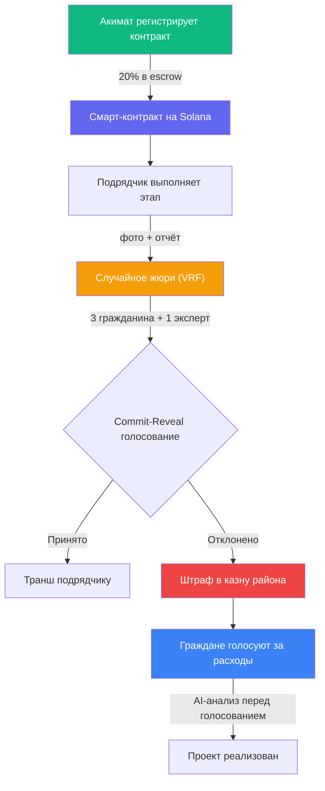
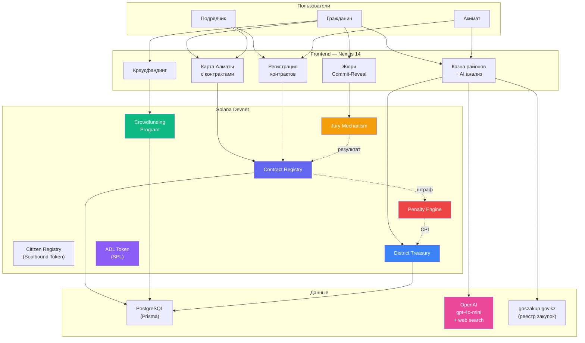
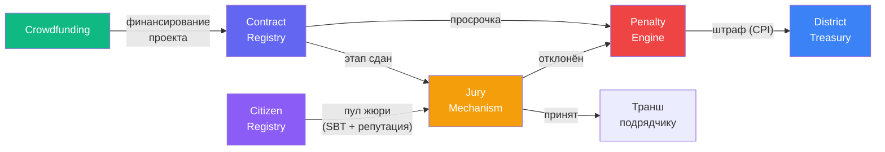
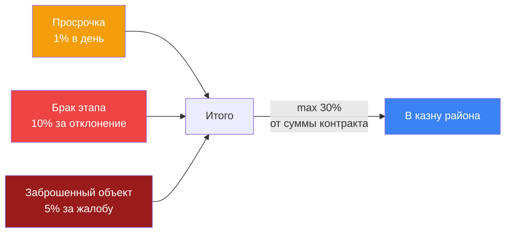
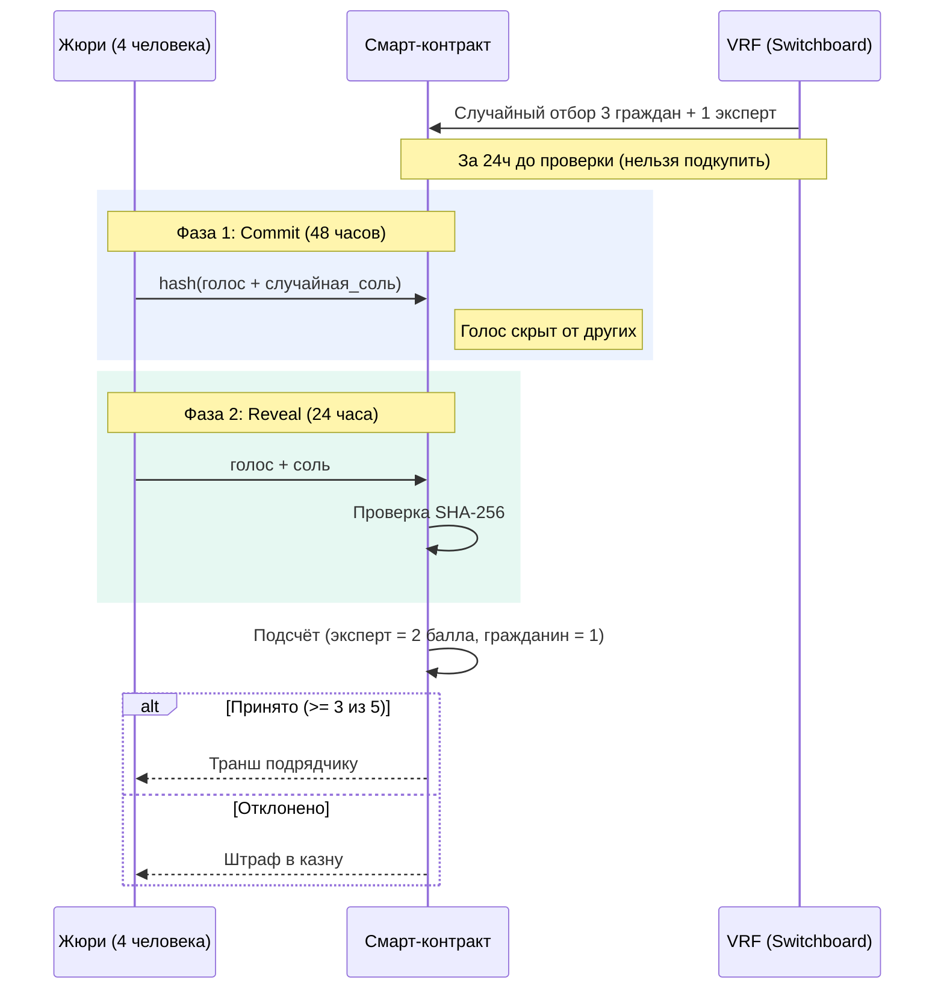
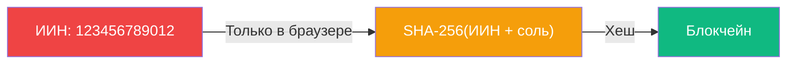
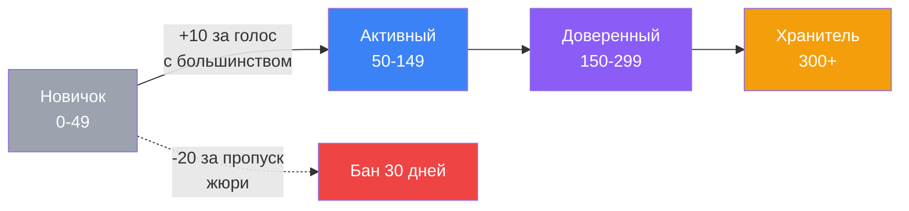

<p align="center">
  
  
  
  
</p>

<h1 align="center"><a href="https://74-208-191-110.nip.io:4443/" target"_blank">Amanat Protocol</a></h1>
Dev server: https://74-208-191-110.nip.io:4443/
<p align="center">
  <b>City DAO для прозрачного мониторинга государственных строительных контрактов Алматы</b>
</p>

---

## Проблема

В 2025 году из **147 муниципальных строительных проектов** Алматы нарушения сроков и качества [выявлены на **26 объектах**](https://informburo.kz/novosti/ploxo-stroiat-i-sryvaiut-sroki-skolko-podriadcikov-narusitelei-i-problemnyx-obieektov-v-almaty). Бюджет города на инфраструктуру превышает **244 млрд тенге** в год, но:

- Подрядчики [получают авансы и исчезают](https://bes.media/news/poluchayut-avans-i-ischezayut-pochemu-ubirayut-predoplatu-podryadchikam-obyasnil-akim-satibaldi/), срывают сроки, передают заказы третьим лицам
- Текущий штраф — [0,01% от суммы контракта](https://informburo.kz/special/darxan-satybaldy-podriadciki-sryvaiushhie-sroki-budut-otstraneny-ot-goszakazov-v-almaty) — не работает как сдерживающий фактор
- 110 компаний привлечены к ответственности, 6 лишены лицензий, [26 переданы в правоохранительные органы](https://tengrinews.kz/kazakhstan_news/podryadchikov-v-almatyi-massovo-lishayut-litsenziy-584421/)
- У граждан нет инструмента для контроля расходования бюджета

## Решение

Amanat Protocol переносит государственные контракты на блокчейн Solana. **20% суммы контракта** замораживается в смарт-контракте (escrow). Штрафы начисляются автоматически. Граждане проверяют качество работ через **случайное жюри**, а расходы районной казны одобряются голосованием с **AI-аналитикой**.

---

## Как это работает



---

## Архитектура

### Общая схема



### 6 смарт-контрактов (Anchor / Rust)



> **Все 6 блоков — отдельные Anchor-программы на Solana.** Стрелки — CPI-вызовы (cross-program invocations) или потоки данных между ними. Contract Registry — центральный: в него приходят деньги из Crowdfunding, из него уходят этапы в Jury, а штрафы через Penalty Engine попадают в District Treasury.

| Программа | Назначение | Ключевые инструкции |
|-----------|-----------|---------------------|
| **Contract Registry** | Регистрация контрактов, escrow 20%, milestones | `register_contract`, `submit_milestone`, `accept_milestone`, `check_deadline` |
| **Citizen Registry** | Soulbound-токен гражданина, репутация | `register_citizen`, `update_reputation` |
| **Jury Mechanism** | Случайный отбор жюри (VRF), commit-reveal | `init_session`, `select_jury`, `commit_vote`, `reveal_vote`, `finalize` |
| **Penalty Engine** | Автоштрафы: 1%/день, 10%/брак, 5%/заброс | `execute_penalty` (CPI в District Treasury) |
| **District Treasury** | Казна района, предложения граждан | `create_proposal`, `vote_on_proposal`, `execute_proposal` |
| **Crowdfunding** | Гражданское софинансирование, гос. субсидия | `init_campaign`, `contribute`, `match_funds`, `refund_all` |

---

## Ключевые механизмы

### Штрафная формула



> **Пример:** Контракт 45 000 000 ₸, просрочка 5 дней + 1 отклонённый этап = штраф 6 750 000 ₸ (15%)

### Commit-Reveal голосование



### Краудфандинг с государственным софинансированием

| Категория | Гос. субсидия | Доля граждан |
|-----------|:------------:|:------------:|
| Детские площадки | 90% | 10% |
| Школы | 90% | 10% |
| Дороги | 70% | 30% |
| Озеленение | 50% | 50% |
| Коммерческие | 0% | 100% |

> Деньги граждан и государства хранятся в escrow смарт-контракте до завершения проекта. Если цель не достигнута к дедлайну — автоматический возврат.

---

## Приватность: хеширование ИИН



ИИН гражданина обрабатывается **исключительно на клиенте** через Web Crypto API. На блокчейн отправляется только SHA-256 хеш. Ни один сервер, API или лог никогда не видит исходный ИИН.

---

## Репутация граждан



| Действие | Изменение |
|----------|:---------:|
| Голос совпал с большинством | **+10** |
| Голос против большинства | **-5** |
| Пропуск жюри | **-20** |
| 3 пропуска подряд | **Бан 30 дней** |

---

## Стек технологий

| Слой | Технологии |
|------|-----------|
| Блокчейн | Solana (devnet), Rust, Anchor 0.32 |
| Токен | SPL Token (ADL — Adal Coin) |
| Frontend | Next.js 14, TypeScript, Tailwind CSS |
| Карты | Leaflet + react-leaflet |
| Кошелёк | Phantom (wallet-adapter) |
| База данных | PostgreSQL + Prisma ORM |
| AI-агент | OpenAI gpt-4o-mini + web_search |
| i18n | Русский + Казахский (next-intl) |
| Тесты | Vitest (unit) + Playwright (e2e) |

---

## Быстрый старт

```bash
npm install        # Установка зависимостей
npm run dev        # Запуск dev-сервера (порт 3000)
npm test           # Юнит-тесты (Vitest)
npm run test:e2e   # E2E-тесты (Playwright)
npm run build      # Production-сборка
```

Приложение работает **без базы данных и кошелька** в demo-режиме с тестовыми данными. Для полной функциональности:

```bash
# .env.local
DATABASE_URL=postgresql://...          # PostgreSQL
OPENAI_API_KEY=sk-...                  # AI-анализ
NEXT_PUBLIC_DATA_SOURCE=onchain        # Чтение из Solana
```

---

## Демо-данные

Приложение включает реалистичные тестовые данные по Алматы:

- **22 контракта** (4 demo + 18 из реестра Госзакупок РК)
- **6 краудфандинг-кампаний** (детские площадки, дороги, освещение, школы)
- **8 районных казн** с предложениями по расходам и историей штрафов
- **3 роли** для тестирования: Гражданин, Подрядчик, Акимат (доступны на странице входа)

---

## Структура проекта

```
city-dao/
├── programs/          # 6 Solana смарт-контрактов (Rust/Anchor)
├── app/               # Next.js 14 App Router (страницы + API)
├── components/        # React-компоненты (карта, карточки, калькулятор штрафов)
├── lib/               # Бизнес-логика, Web3-хуки, типы данных
├── prisma/            # Схема БД (15+ моделей) + seed-данные
├── tests/             # E2E-тесты (Playwright)
├── __tests__/         # Юнит и API тесты (Vitest)
└── scripts/           # Деплой, seed, IDL-верификация
```

---

## Команда

Разработано командой **no fomo** (Алматы, Казахстан) для хакатона Decentrathon.

---

<p align="center">
  <sub>Hackathon prototype. All rights reserved.</sub>
</p>
